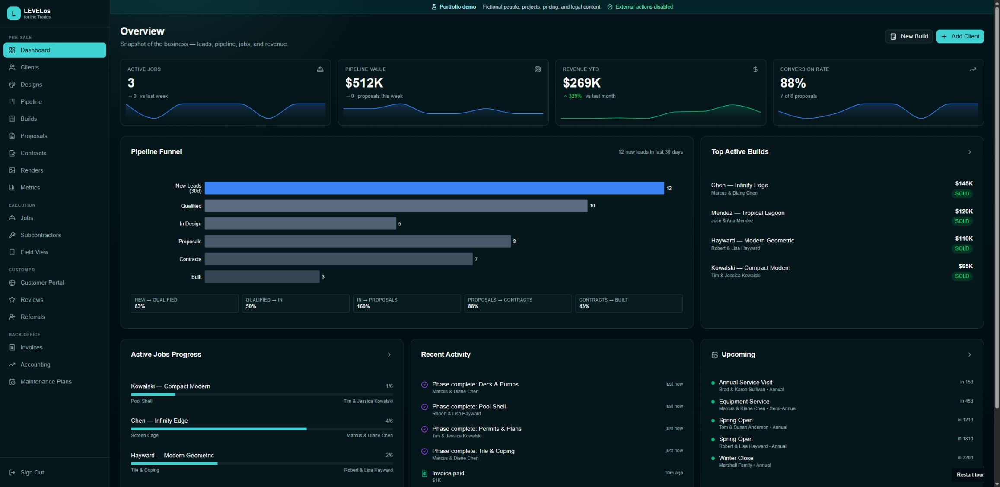
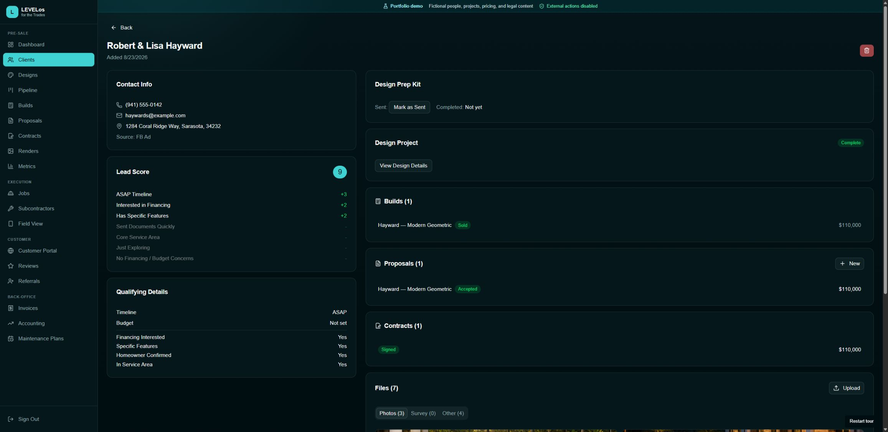
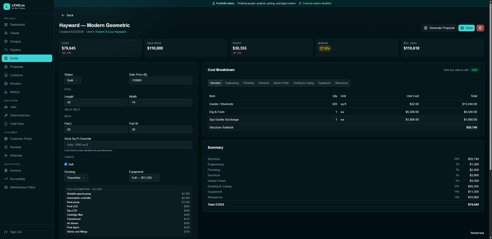
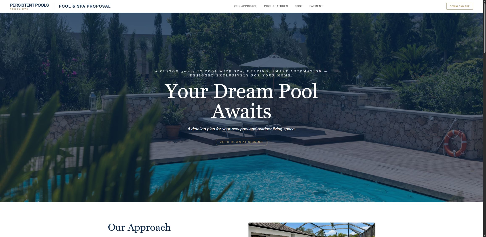
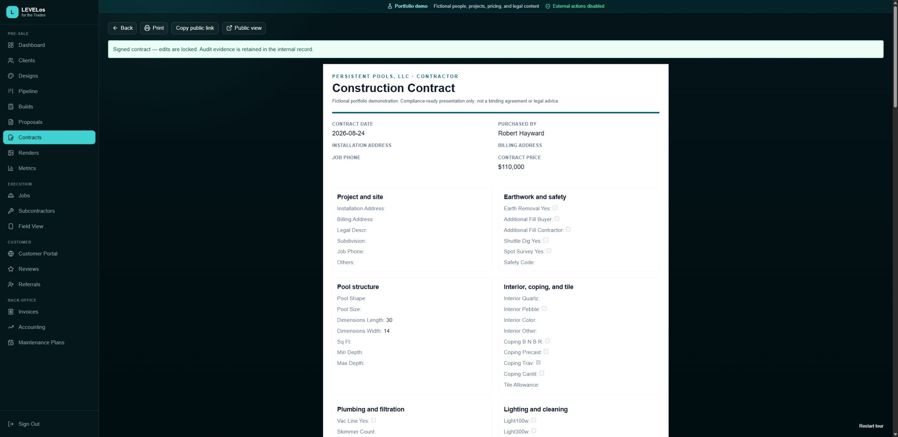
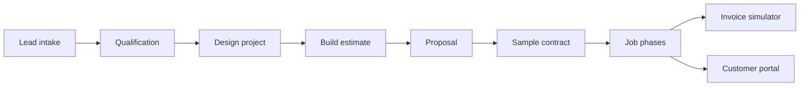

# LEVELos for the Trades — Persistent Pools Demo

A sanitized, redesigned portfolio edition of an internal operations system built for a Southwest Florida pool company. The application connects the work that normally lives across forms, spreadsheets, design tools, proposals, contracts, job tracking, and accounting.

> **Portfolio scope:** The workflow and domain model are production-derived. The interface is a portfolio redesign, all people and projects are fictional, pricing inputs are illustrative, legal documents are samples, and live company integrations are disabled.

## Live demo

**[Open the hosted portfolio demo →](https://levelos-trades-demo.vercel.app)**

Select **Start demo** to enter—no account or credentials are required. A guided portfolio tour then leads through client intake, estimating, proposal generation, and the compliance-ready contract workflow. Use **Skip tour** or **Restart tour** at any time. The hosted app starts from a dedicated synthetic dataset and runs from ephemeral storage, so visitor changes are temporary. Email, Trello, payments, production storage, and every private company integration remain disabled.

## Product tour

### Operations overview

Pipeline, revenue, conversion, active-build, and upcoming-work signals in one operating view.



### Client workspace

A single client record connects qualification, design preparation, the configured build, proposal, contract, and job history.



### Deterministic build estimating

Editable dimensions and options roll into phase-level costs, sale price, gross profit, and margin analysis.



### Customer-facing proposal

Internal estimate data becomes a polished visual proposal with renders, project features, milestones, and investment details.



### Compliance-ready contract

Client, build, and proposal data flows into a readable print-first agreement with milestone payments, 16 acknowledgments, typed-signature consent, and tamper-evident audit details.



## The workflow



The main portfolio path is:

1. Review the synthetic pipeline and client record.
2. Configure a pool build and inspect the deterministic cost breakdown.
3. Generate a proposal and open its customer-facing share view.
4. Preview the sample contract flow.
5. Follow the job through construction phases, accounting, and the customer portal.

## Why this project matters

This is not an AI feature demo. It demonstrates the product and engineering work required to translate a real operating process into software:

- Domain modeling across clients, designs, builds, proposals, contracts, jobs, invoices, costs, reviews, referrals, and maintenance.
- Deterministic estimating with line-item and margin analysis.
- Separate internal, field, and customer-facing experiences.
- Tokenized share routes that expose only customer-safe projections.
- Synthetic, repeatable demo data for reliable walkthroughs.
- Responsive operational dashboards and mobile field views.

The original system was built through AI-assisted development. Product decisions, workflow design, domain validation, deployment, and operational use remained human-owned.

## Technology

- Next.js 16, React 19, and TypeScript
- Prisma with SQLite locally and libSQL/Turso support for isolated deployments
- Tailwind CSS and Radix UI
- Zod and React Hook Form
- Recharts for operational reporting
- Vercel Blob and Resend adapters, disabled in public-demo mode

See [the architecture notes](docs/ARCHITECTURE.md) for the application boundaries and data-safety model.

## Run locally

Requirements: Node.js 22 and npm.

```bash
npm install
```

Copy `.env.example` to `.env`, replace the session-secret placeholder, then initialize the synthetic database:

```bash
npm run demo:setup
npm run dev
```

Open [http://localhost:3000](http://localhost:3000) and select **Start demo**.

Rebuild the demo at any time with:

```bash
npm run db:seed
```

Use `npm run demo:tokens` to print fresh local URLs for the customer portal, proposal, payment simulator, and review flows. Do not commit generated tokens.

## Verification

```bash
npm run lint
npm run typecheck
npm test
npm run audit:images
npm run build
```

The CI workflow runs the same checks and audits production dependencies at high severity.

## Public-demo safeguards

- No production database, storage bucket, email account, or Trello board is required.
- `PUBLIC_DEMO=true` disables external email, Trello, and remote-upload side effects.
- Session creation fails closed when the session secret is missing or invalid.
- Runtime uploads and local databases are ignored.
- Bundled media hashes and every seeded image reference are checked against a pool-only allowlist.
- Seeded emails use `example.com`; phone numbers and addresses are fictional.
- Cost inputs, vendor names, legal terms, signatures, and license identifiers are illustrative or redacted.
- Payment is a simulator and never collects card or bank data.

For the full release boundary, see [SECURITY.md](SECURITY.md). For a concise review path, see [the demo walkthrough](docs/DEMO-WALKTHROUGH.md), or review the [narrated walkthrough recording guide](docs/WALKTHROUGH-VIDEO.md). Before publishing, follow the [clean-history publication checklist](docs/PUBLICATION-CHECKLIST.md).

## Source status

This repository is source-available for portfolio review. It is not the private production repository and is not offered as construction, financial, or legal software. See [LICENSE.md](LICENSE.md).
